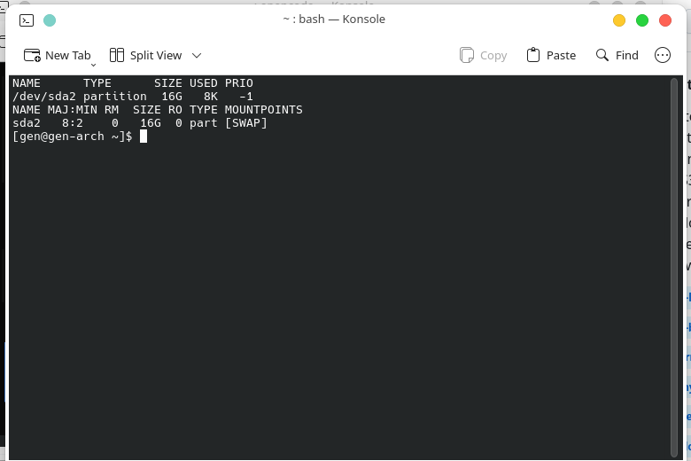

# Hibernation on Arch / Ubuntu / Fedora — Enable Linux Hibernate & Resume

How to enable **Linux hibernation** (suspend-to-disk) so the OS saves its exact state to swap and restores it on next boot. Keywords: arch linux hibernate, ubuntu hibernate, fedora hibernate, linux not resuming from hibernate, enable hibernate linux, hibernate option not showing, gnome hibernate button missing, add hibernate to power menu, hibernate fails, cannot hibernate linux, linux hibernate dual boot windows.

## TL;DR
```
blkid /dev/sda2                      # note swap UUID
# add resume=UUID=... to kernel cmdline
# add resume hook to initramfs & rebuild
# ensure swap line is in /etc/fstab
systemctl hibernate
```


## Conditions
- Swap must be **>= RAM size** (this machine: 16G swap vs ~8G RAM).
- On this dual-boot setup, swap is a separate partition (`sda2`). A swap file also works if given a higher priority and correct `resume_offset` (btrfs excluded here).
- Secure Boot not covered.

## 1. Kernel resume parameter
Append to kernel cmdline:
```
resume=UUID=1605ff27-5303-47c9-9831-c098620d98e6
```
Use `UUID=$(blkid -s UUID -o value /dev/sda2)` to find yours.

- **Arch / Ubuntu** (GRUB): set in `/etc/default/grub`:
  ```
  GRUB_CMDLINE_LINUX_DEFAULT="resume=<UUID> ..."
  sudo grub-mkconfig -o /boot/grub/grub.cfg   # Ubuntu: /boot/grub/grub.cfg
  ```
- **Fedora** (BLS): use `grubby --update-kernel=ALL --args="resume=UUID=<UUID>"` (no grub-mkconfig).

## 2. Initramfs resume hook
- **Arch (mkinitcpio):** add `resume` to `HOOKS` in `/etc/mkinitcpio.conf`:
  ```
  HOOKS=(base udev autodetect microcode modconf kms keyboard keymap consolefont block plymouth resume filesystems fsck)
  ```
  Then: `sudo mkinitcpio -P`
- **Ubuntu (initramfs-tools):** create `/etc/initramfs-tools/conf.d/resume`:
  ```
  RESUME=UUID=<UUID>
  ```
  Then: `sudo update-initramfs -u`
- **Fedora (dracut):** usually automatic if resume= is on the cmdline; for LUKS you may need `dracut --regenerate-all --force`.

## 3. fstab
```
UUID=1605ff27-5303-47c9-9831-c098620d98e6  none  swap  defaults  0 0
```

## Show Hibernate in the power menu
- **KDE Plasma:** appears automatically once logind reports `CanHibernate = yes` (check: `gdbus call --system --dest org.freedesktop.login1 --object-path /org/freedesktop/login1 --method org.freedesktop.login1.Manager.CanHibernate`).
- **GNOME:** not built in — install the "Hibernate Status Button" GNOME Shell extension.
- **Any DE:** `systemctl hibernate`.

## Test
```bash
systemctl hibernate
```



## Limitations
- Never hibernate while the Windows NTFS partition (`sda4`) is mounted, and disable Windows Fast Startup so Windows itself isn't in a hibernated state at the same time.
- If resume fails, your session is lost — check `journalctl -b` for `PM: hibernation` messages.
- System with hibernation disabled can't save RAM to swap: verify `cat /sys/power/state` (should include `disk`).

## Troubleshooting

**`systemctl hibernate` says "Operation not permitted" / "Not supported".** Check `systemctl status systemd-hibernate`, logind's `CanHibernate`, and that swap ≥ RAM.

**Black screen / hangs on resume (never comes back).** Try `resume=` with correct UUID; ensure initramfs includes `resume` hook; some GPUs need `nomodeset` during the hibernate boot (then switch back).

**Machine reboots instead of resuming.** UUIDs changed (distro stored old UUID in grub): rerun `grub-mkconfig` / `grubby`.

**Session lost after successful hibernate + boot.** Swap was reformatted/smaller than RAM, or another OS touched the swap partition.

## Bundled files
- `mkinitcpio.conf` → Arch: `/etc/mkinitcpio.conf`
- `fstab-swap` → swap line for `/etc/fstab`
