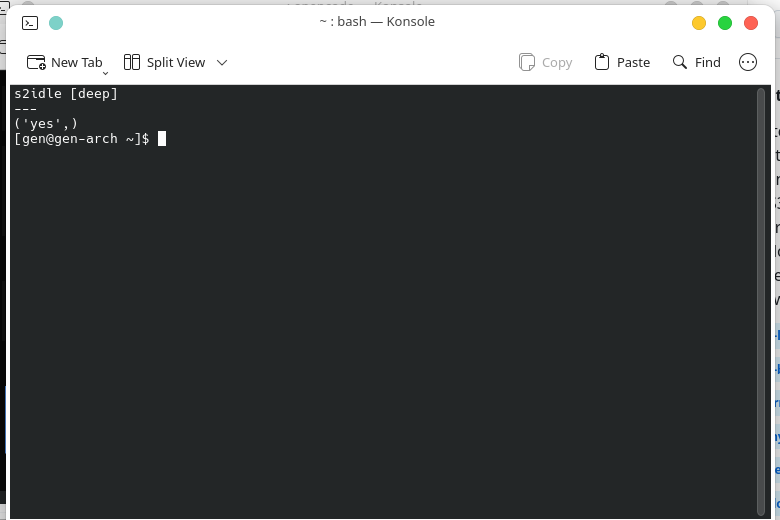

# S3 (Deep) Sleep — Arch / Ubuntu / Fedora

Force S3 (`deep`) sleep instead of modern standby (`s2idle`). Keywords: linux mem_sleep_default deep, s3 sleep not working, s2idle vs deep, sleep not waking up linux, laptop sleep drains battery.

## Also try
```bash
echo deep | sudo tee /sys/power/mem_sleep   # temporary, one boot
```

## Current state (this machine)
```bash
cat /sys/power/mem_sleep
# s2idle [deep]
```



## How to set
Add to kernel cmdline:
```
mem_sleep_default=deep
```
- Arch/Ubuntu: edit `/etc/default/grub` → `GRUB_CMDLINE_LINUX_DEFAULT`, then `sudo grub-mkconfig -o /boot/grub/grub.cfg`.
- Fedora: `sudo grubby --update-kernel=ALL --args="mem_sleep_default=deep"`.

## Conditions / limitations
- S3 is only listed in `/sys/power/mem_sleep` if the firmware/hardware supports it. Some newer laptops dropped S3; then `deep` won't appear.
- Works on Intel CPUs of this era (i3-6006U, Skylake). AMD equivalents: check `cat /sys/power/mem_sleep` after reboot.
- In this setup, `ctos-hibernate-on.service`/`ctos-hibernate-off.service` play ctOS sounds around suspend (see [ctos-sounds](../ctos-sounds/)).
- Check wake sources: `cat /proc/acpi/wakeup`, `systemctl status systemd-suspend*`.
